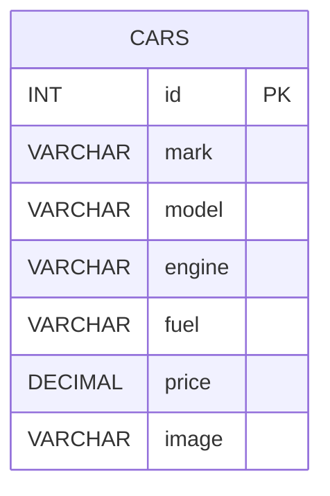
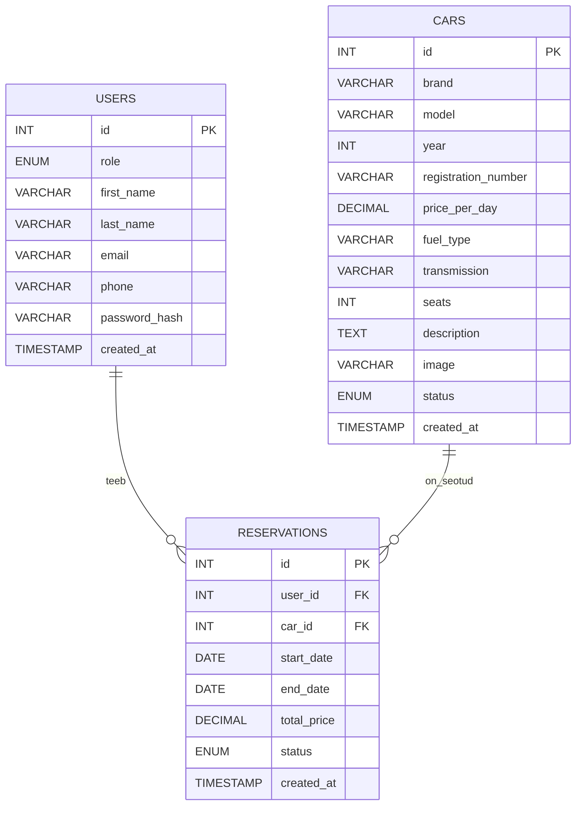

# Autorendi projekt – idee\* ja tegevusetapid

## Projekti eesmärk ja reeglid

Eesmärk on ehitada lihtne autorendi veebileht PHP + MySQL + Bootstrap 5 abil nii, et tekiks arusaam:
kuidas lehed kokku töötavad, kuidas andmed tulevad andmebaasist, kuidas teha otsingut, detailvaadet, admini, autentimist ja broneeringu reegleid.

Tehnilised piirangud:

- PHP + mysqli (ilma raamistiketa)
- Bootstrap 5 (minimaalne disain, võimalikult vähe oma CSS-i)
- Selge failistruktuur ja väiksed sammud
- Iga etapi lõpus töötab midagi nähtavat

Soovituslik failistruktuur (lihtne ja arusaadav):

- `public/` (avalikud lehed: avaleht, autode list, detail)
- `admin/` (admini vaated)
- `inc/` (ühendus, abifunktsioonid, header/footer)
- `sql/` (tabelite loomise skriptid)
- `README.md`

---

## Etapp 1 – Kujundus pildi järgi (ilma andmebaasita)

Eesmärk: Bootstrapiga "makett" valmis, et hiljem andmed sisse tõsta.

Tee:

- Navbar: Avaleht, Autod, Hinnad, Kontakt + otsingukast (veel ei tööta)
- Hero-plokk: vasakul tekst + nupp, paremal suur pilt
- Autokaardid gridis (4 veergu desktopis, 2 tahvlis, 1 mobiilis)
- Lisa pagination (veel "võlts", ainult välimus)

Tulemus:

---

## Etapp 2 – Andmebaas ja esimene tabel (cars)

Eesmärk: andmed tulevad MySQL-ist.

Loo tabel `cars` väljadega:

- `id`
- `mark`
- `model`
- `engine`
- `fuel`
- `price`
- `image` (siia salvestad näiteks ühe märksõna, nt `audi`, `bmw`, `mercedes`)

Näide: pildi URL tekib dünaamiliselt:

- `https://loremflickr.com/400/250/<image>`

Tee:

- `inc/db.php` (mysqli ühendus)
- `public/autod.php` loeb `SELECT * FROM cars` ja kuvab kaardid.

Tulemus: autode list töötab päriselt andmebaasi pealt.

---

## Etapp 3 – Otsing (mark ja model)

Eesmärk: GET-parameetriga otsing, ilma keerulise UI-ta.

Tee:

- Navbaris otsinguväli `name="q"`.
- `autod.php` filtreerib:
  - kui `q` tühi → kõik autod
  - kui `q` olemas → `WHERE mark LIKE ... OR model LIKE ...`

Õppimise rõhk:

- kuidas GET töötab
- miks tuleb sisendit turvalisemaks teha (siin hoiad lihtsa, aga mainid prepared statementi ideed)

Tulemus: otsing töötab ja annab kohe tagasisidet.

---

## Etapp 4 – Detailvaade (Rendi nupp viib auto lehele)

Eesmärk: üks auto eraldi lehel, ID põhjal.

Tee:

- Kaardil nupp "Rendi" viib: `auto.php?id=123`
- `auto.php` teeb `SELECT * FROM cars WHERE id = ?`
- Kuvad suure pildi, nime, mootori, kütuse, hinna.

Tulemus: klikitav detailvaade olemas.

---

## Etapp 5 – Cars tabeli laiendamine (rohkem "päris" infot)

Eesmärk: näidata, kuidas skeem kasvab, kui funktsionaalsus nõuab rohkem andmeid.

Lisa `cars` tabelisse (näiteks):

- `year`
- `transmission`
- `seats`
- `description`
- `status` (nt `available`, `maintenance`)

Tee:

- SQL `ALTER TABLE`
- Detailvaade kuvab uued väljad
- Autode list võib kuvada 1–2 uut rida (nt aasta ja käigukast)

Tulemus: õppija näeb, et andmebaas pole kivisse raiutud.

---

## Etapp 6 – Admin: autode lisamine (CRUD-i algus)

Eesmärk: lihtne "lisa auto" vorm.

Tee:

- `admin/index.php` (admin menüü)
- `admin/add_car.php` vorm
- `admin/save_car.php` INSERT mysqli abil
- pärast salvestust redirect tagasi listi või admin avalehele

Piirang:

- ainult "Create" (lisamine), et mitte paisutada.

Tulemus: admin saab autosid lisada ja need ilmuvad avalikku vaatesse.

---

## Etapp 7 – Admini turvamine (sessioon + lihtne login)

Eesmärk: seletada "miks avalikku admini ei jäeta".

Lihtne lahendus (õppijale sobiv):

- `admin/login.php` (kasutaja/parool näiteks `.env` või eraldi configis)
- `$_SESSION['is_admin'] = true`
- `admin/*` lehtedel kontroll:
  - kui pole admin → redirect login lehele

Tulemus: admin on "lukus", tekib arusaam sessioonist.

---

## Etapp 8 – Kasutajad ja reserveeringud (uued tabelid)

Eesmärk: päris autorendi "tuum": broneeringud ajavahemikuga.

Lisa tabelid:

- `users` (hiljem Google loginiga täidetav)
- `reservations` (seob kasutaja + auto + kuupäevad)

Tee:

- `auto.php` lehele lihtne broneeringuvorm: algus ja lõpp (DATE).
- "Arvuta koguhind": päevade arv × price_per_day.
- Salvesta `reservations` tabelisse.

Tulemus: broneering tekib ja hind arvutatakse.

---

## Etapp 9 – Broneeringu piirang: sama auto ei tohi kattuda

Eesmärk: lihtne, aga "päris" ärireegel.

Reegel:

- Uus broneering on keelatud, kui olemasoleva broneeringu periood kattub uuega.

Kattuvuse loogika (inimkeeles):

- kattub siis, kui uus algus on enne vana lõppu JA uus lõpp on pärast vana algust

SQL idee:

- `WHERE car_id = ? AND status IN ('active')`
- `AND (new_start <= end_date) AND (new_end >= start_date)`

Tulemus:

- kui kattub → kuva veateade detailvaates
- kui ei kattu → salvesta broneering

---

## Etapp 10 – Google Login (Google API)

Eesmärk: päris kasutajakonto ilma paroolihalduse keerukuseta.

Tee:

- Google OAuth: login nupp "Logi sisse Google’iga"
- callbackis saad e-posti ja nime
- kui kasutajat pole → loo `users` tabelisse
- salvesta sessiooni `user_id`
- broneeringu tegemine nõuab sisselogimist

Tulemus: kasutaja tuvastus on realistlik ja õpetlik.

---

# Mermaid ER-diagrammid README jaoks

## 1) Algus: ainult Cars

Pane README-sse näiteks "Etapp 2" juurde.

## 2) Lõppversioon: Users + Cars + Reservations

Pane README-sse "Etapp 8+" juurde.

---

Soovi korral saad selle sama plaani muuta ka hindamisjuhiseks: iga etapp = kindel punktisumma ja kontrollnimekiri (mis peab töötama).

[https://loremflickr.com/400/250/mercedes](https://loremflickr.com/400/250/mercedes)
