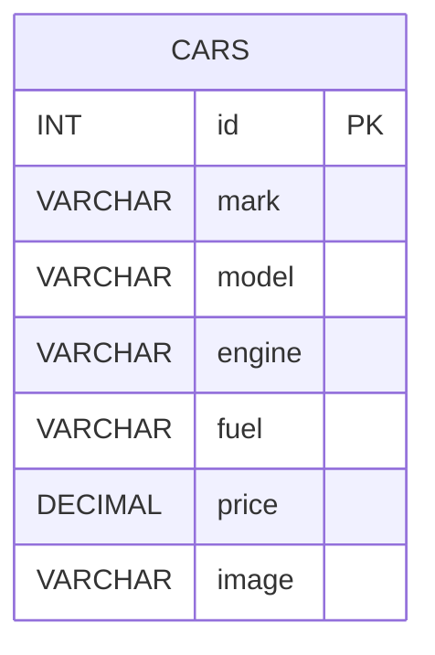
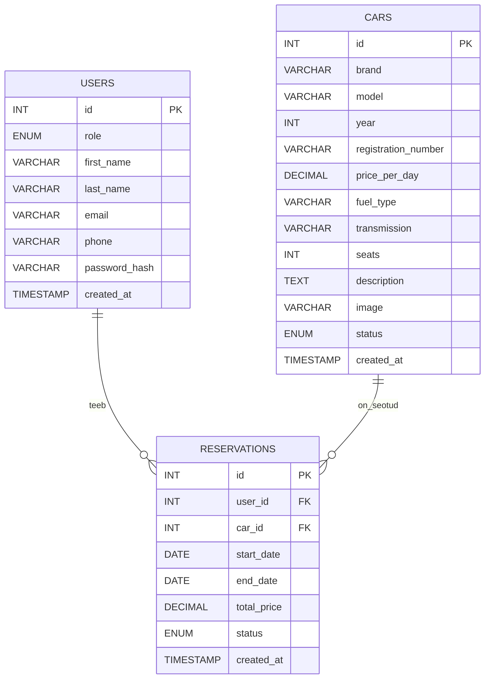

# Autorendi projekt: ideed- ja tegevusetapid

## Projekti eesmärk ja reeglid

Eesmärk on ehitada lihtne autorendi veebileht PHP + MySQL + Bootstrap 5 abil nii, et tekiks arusaam:
kuidas lehed kokku töötavad, kuidas andmed tulevad andmebaasist, kuidas teha otsingut, detailvaadet, admini, autentimist ja broneeringu reegleid.

Tehnilised piirangud:

- PHP + mysqli (ilma raamistiketa)
- Bootstrap 5 (minimaalne disain, võimalikult vähe oma CSS-i)
- Selge failistruktuur ja väiksed sammud
- Iga etapi lõpus töötab midagi nähtavat

Soovituslik failistruktuur (lihtne ja arusaadav):

- `public/` (avalikud lehed: avaleht, autode list, detail)
- `admin/` (admini vaated)
- `inc/` (ühendus, abifunktsioonid, header/footer)
- `sql/` (tabelite loomise skriptid)
- `README.md`

---

## Etapp 1 – Kujundus pildi järgi (ilma andmebaasita)

Eesmärk: Bootstrap 5ga "makett" valmis, et hiljem andmed sisse tõsta

Tee:

- Navbar: Avaleht, Autod, Hinnad, Kontakt + otsingukast
- Hero-plokk: vasakul tekst + nupp, paremal suur pilt
- Autokaardid gridis (4 veergu desktopis, 1 mobiilis)
- Lisa pagination

Tulemus:

---

## Etapp 2 – Andmebaas ja esimene tabel (cars)

Eesmärk: andmed tulevad MySQL-ist

Loo tabel `cars` väljadega:

- `id`
- `mark`
- `model`
- `engine`
- `fuel`
- `price`
- `image`

Näide: võid kasutada hetkel `https://loremflickr.com/400/250/<muutuja_automark>`

Tulemus: autode list töötab päriselt andmebaasi pealt

---

## Etapp 3 – Otsing (mark ja model)

Eesmärk: GET-parameetriga otsing

Tee:

- Navbaris otsinguväli näiteks `name="q"`
- `autod.php` filtreerib:
  - kui `q` tühi → kõik autod
  - kui `q` olemas → `WHERE mark LIKE ... OR model LIKE ...`

Tulemus: otsing töötab ja annab kohe tagasisidet

---

## Etapp 4 – Detailvaade (Rendi nupp viib auto lehele)

Eesmärk: üks auto eraldi lehel, ID põhjal

Tee:

- Kaardil nupp "Rendi" viib: `auto.php?id=123`
- `auto.php` teeb `SELECT * FROM cars WHERE id = ?`
- Kuvad suure pildi, nime, mootori, kütuse, hinna

Tulemus: klikitav detailvaade olemas

---

## Etapp 5 – Cars tabeli laiendamine

Eesmärk: andmebaasi tabeli muutmine

Lisa `cars` tabelisse täiendus:

- `year`
- `transmission`
- `seats`
- `description`
- `status` (nt `vaba`, `rendidud`, `hoolduses`)

Tulemus: autode tabel kuvab rohkem andmeid

---

## Etapp 6 – Admin: autode lisamine (CRUD-i algus)

Eesmärk: autode haldusliides

Tee:

- `admin/index.php` (adminil oma menüü)
  

- `admin/add_car.php` vorm
  

- pärast salvestust suunatakse tagasi admin avalehele
- lisa kustutamine
- lisa muutmine

Tulemus: admin saab autosid lisada, kustutada, muuta ja need ilmuvad avalikku vaatesse

---

## Etapp 7 – Admini turvamine (sessioon + lihtne login)

Eesmärk: admini vaadete turvamine

Lihtne lahendus:

- `admin/login.php` (krüpteeritud parool)
- loo sessioon `$_SESSION['is_admin'] = true`
- kontrolli, et kõik admin lehed oleks kaitstud:
  - kui pole admin, siis suuna login lehele

Tulemus: admin on "lukus"

---

## Etapp 8 – Kasutajad ja reserveeringud (uued tabelid)

Eesmärk: broneeringud ajavahemikuga.

Lisa tabelid:

- `users`
- `reservations` (seob kasutaja + auto + kuupäevad)

Tee:

- `auto.php` lehele lihtne broneeringuvorm: algus ja lõpp (DATE)
- "Arvuta koguhind": päevade arv × price_per_day
- Salvesta `reservations` tabelisse

Tulemus: broneering tekib ja hind arvutatakse

---

## Etapp 9 – Broneeringu piirang: sama auto ei tohi kattuda

Eesmärk: broneeringu piirangud

- Uus broneering on keelatud, kui olemasoleva broneeringu periood kattub uuega.
- kattub siis, kui uus algus on enne vana lõppu JA uus lõpp on pärast vana algust

SQL idee:

- `WHERE car_id = ? AND status IN ('active')`
- `AND (new_start <= end_date) AND (new_end >= start_date)`

Tulemus:

- kui kattub, siis kuva veateade detailvaates
- kui ei kattu, salvesta broneering

---

## Lõppversioon andmebaasist: Users + Cars + Reservations

Pane README-sse "Etapp 8+" juurde.

